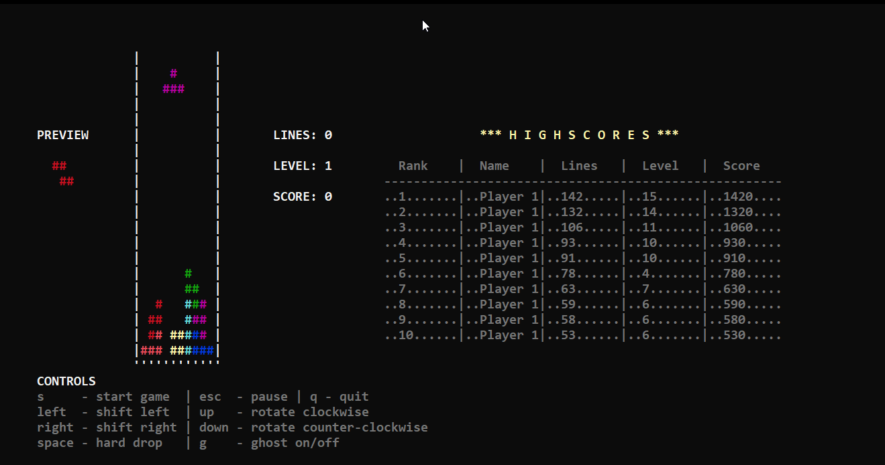

# Tetris

This project is mainly for learning C++. Besides that, I would like to implement Tetris according the "Tetris Guideline" as formulated here:
https://tetris.wiki/Tetris_Guideline. Another goal is to make it run on Windows, Linux and Mac, in console mode and later also in gui mode. 

I am very interested in honest feedback and I would be happy about collaboration :-).

## Playing Tetris
< arrow left >  - move Tetromino to the left  
< arrow rigth > - move Tetromino to the rigth  
< arrow up >    - rotate Tetromino clockwise  
< arrow down >  - rotate Tetromino counterclockwise  
< space >       - let the Tetromino immediately fall to the very bottom  
< g >           - enable / disbale ghost stone  
< ESCAPE >      - enable / disable pause  

## Extending the visualization
The Tetris class controls the state of the game. Adding a new visualisation means to implement the interface Tetris_Draw.

## External libraries
- sqlite3 for storing game stats
- boost for threads
