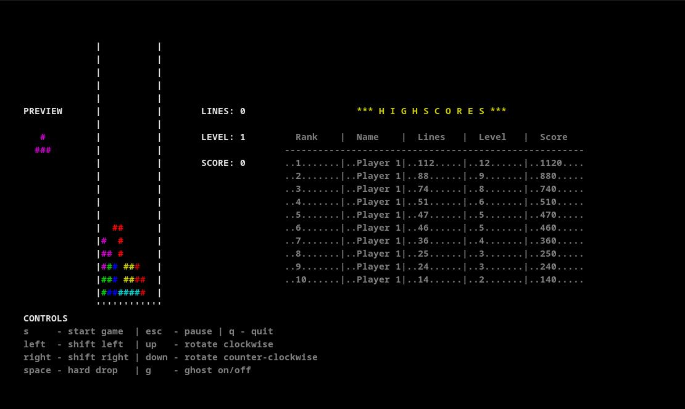

# Tetris

This project is mainly for learning C++. Besides that, I would like to implement Tetris according the "Tetris Guideline" as formulated here:
https://tetris.wiki/Tetris_Guideline. Another goal is to make it run on Windows, Linux and Mac, in console mode and later also in gui mode. 

I am very interested in honest feedback and I would be happy about collaboration :-).

## Screenshots
### Windows

### Mac OS

### Linux

## Playing Tetris
< arrow left >  - move Tetromino to the left  
< arrow rigth > - move Tetromino to the rigth  
< arrow up >    - rotate Tetromino clockwise  
< arrow down >  - rotate Tetromino counterclockwise  
< space >       - let the Tetromino immediately fall to the very bottom  
< g >           - enable / disbale ghost stone  
< ESCAPE >      - enable / disable pause  

## Implementation Details
The Tetris class controls the state of the game. It is supposed to be platform independent. Thus it does not draw and it does not detect keyboard input.

How to draw then? The Tetris constructor expects as its first argument a pointer to an implemtation of the interface Tetris_Draw. 
The Tetris class calls this interface accordingly. Adding another visualisation of Tetris means to implement the interface Tetris_Draw.

How does the Tetris class react on keyboard inputs? Keyboard input shall be signaled by the user calling the public interface of the Tetris class:
- for < arrow up >, call `void key_up();`    
- for < arrow down >, call `void key_down();`  
- for < arrow left >, call `void key_left();`  
- for < arrow right >, call `void key_right();` 
- for < space >, call `void key_space();` 
- for < g >, `void key_g();`    
- for < escape >, call `void key_escape();`

Thus, it is the responsibility of the user to detect keyboard inputs and signal those to the Tetris object. Optionally, as a second argument to the Tetris constuctor, 
the user can provide a function pointer `void (*func)(Tetris *Tetris_object)`. The adressed function is supposed to perform the keyboard detection and is expected to call 
`key_<key>()`. Tetris controls the execution of func() in a boost-thread. When providing the second argument, the implementation of func() shall provide an interruption point, 
i.e. calling `boost::this_thread::sleep_for()`. This way Tetris can trigger the termination of the thread when calling `interrupt()`. When the second argument is not specified, 
Tetris is just ignoring it and does not spawn a thread. 

## External libraries
- sqlite3 for storing game stats
- curses for drawing in unix like consoles
